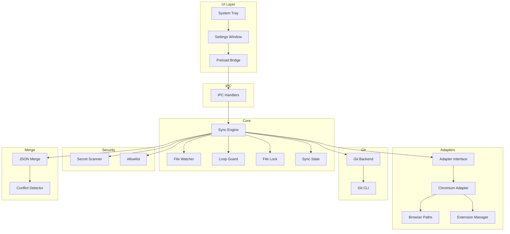

<p align="center">
  <h1 align="center">Synkromium</h1>
  <p align="center">
    <strong>Your browser, everywhere.</strong>
    <br />
    Keep your Chromium browser settings and extensions in sync across all your devices — privately, automatically, and powered by Git.
    <br />
    <br />
    <a href="#-quick-start"><strong>Quick Start »</strong></a>
    &nbsp;&nbsp;·&nbsp;&nbsp;
    <a href="https://github.com/tokitauhid/Synkromium/issues">Report Bug</a>
    &nbsp;&nbsp;·&nbsp;&nbsp;
    <a href="https://github.com/tokitauhid/Synkromium/issues">Request Feature</a>
  </p>
</p>

> [!WARNING]
> **🚧 EARLY BETA RELEASE 🚧**
> Synkromium is currently in active beta development. While the core features are functional, you may encounter edge cases or bugs. **Please manually back up your browser profile** before using Synkromium on your daily driver.

<br />

<p align="center">
  <a href="#"></a>
  <a href="LICENSE"></a>
  <a href="#"></a>
  <a href="#"></a>
  <a href="#"></a>
</p>

---

## 🧭 Table of Contents

- [Why Synkromium?](#-why-synkromium)
- [Features](#-features)
- [How It Works](#-how-it-works)
- [Supported Browsers](#-supported-browsers)
- [Quick Start](#-quick-start)
- [Configuration](#-configuration)
- [Architecture](#-architecture)
- [Security](#-security)
- [Development](#-development)
- [Project Structure](#-project-structure)
- [Roadmap](#-roadmap)
- [Contributing](#-contributing)
- [FAQ](#-faq)
- [License](#-license)

---

## 💡 Why Synkromium?

You use Chrome on your laptop. You use Chrome on your desktop. You like your extensions, your settings, your bookmarks — consistent everywhere. But syncing through Google means handing your data to a third party.

**Synkromium gives you the sync without the surveillance.**

It uses a **private Git repository** (on GitHub, GitLab, or any Git host) as the transport and storage layer. Your data stays in a repo you own. No proprietary servers, no telemetry, no vendor lock-in. Just Git.

| Traditional Sync | Synkromium |
|---|---|
| ☁️ Data stored on vendor servers | 🔒 Data stored in your private Git repo |
| 🔍 Vendor can read your data | 🙈 Only you have access |
| 🚫 No version history | 📜 Full Git history — every change tracked |
| ⛓️ Locked to one browser vendor | 🌐 Works across Chrome, Brave, Edge, Chromium |
| ❓ Opaque sync protocol | 📖 Plain JSON files you can inspect anytime |

---

## ✨ Features

### Core
- **🔄 Automatic Sync** — Detects settings changes in real time and syncs them in the background
- **🌐 Multi-Browser Support** — Works with Chrome, Brave, Edge, and Chromium
- **🔌 Extension Sync** — Syncs your list of installed extensions (IDs and metadata, not binaries)
- **📑 Bookmark Sync** — Keeps your bookmarks consistent across devices
- **⚙️ Settings Sync** — Homepage, search engine, UI preferences, and more

### Privacy & Security
- **🔒 Private by Design** — All data lives in your own private Git repository
- **🛡️ Pre-Commit Secret Scanner** — Automatically scans for API keys, tokens, and passwords before every sync — blocks the commit if anything is found
- **📋 Allowlist-Based Syncing** — Only explicitly approved files are ever synced. No blocklist, no exceptions
- **🔑 Secure IPC** — Renderer process is fully sandboxed with `contextIsolation` and a controlled preload bridge

### Reliability
- **📴 Offline-First** — Works without internet. Changes are committed locally and pushed when connectivity returns
- **🔁 Loop Prevention** — Triple-layered safeguards (watcher suspension, commit fingerprinting, commit tagging) prevent infinite sync cycles
- **🔐 File Locking** — Prevents concurrent sync operations from corrupting data
- **✅ Restore Verification** — Validates settings after every restore to catch corruption early

### User Experience
- **🖥️ Glassmorphic Desktop UI** — A polished Electron settings panel with a modern, dark glassmorphism design
- **📌 System Tray App** — Lives quietly in your taskbar with real-time status indicators
- **⚡ One-Click Sync** — Trigger a manual sync anytime from the tray menu
- **🧭 First-Run Wizard** — Guided setup on first launch — enter your GitHub credentials and start syncing

---

## ⚙️ How It Works

Synkromium sits between your browser and a private Git repository, translating browser settings into portable, version-controlled JSON.

```
┌────────────────────────┐
│   Chromium Browser     │   Your browser's settings files
│   (Chrome/Brave/Edge)  │   (Preferences, Bookmarks, Extensions)
└──────────┬─────────────┘
           │
           ▼
┌────────────────────────┐
│     Adapter Layer      │   Extracts & restores settings
│  (extract / restore)   │   per-browser, isolated & testable
└──────────┬─────────────┘
           │
           ▼
┌────────────────────────┐
│     Sync Engine        │   Orchestrates the full push/pull cycle
│  • Change detection    │   Debounces, validates, scans for secrets,
│  • Loop prevention     │   locks, commits, and syncs — all automatic
│  • Conflict handling   │
└──────────┬─────────────┘
           │
           ▼
┌────────────────────────┐
│     Git Backend        │   Wraps the native Git CLI
│  (private repository)  │   Push/pull to GitHub, GitLab, etc.
└────────────────────────┘
```

### Push Flow (Local → Remote)

```
File Change Detected (chokidar)
         ↓
   Is syncing? → YES → discard
         ↓ NO
   Debounce (7 seconds)
         ↓
   Acquire lock
         ↓
   Extract settings via adapter
         ↓
   Validate extracted state
         ↓
   Filter through allowlist
         ↓
   Secret scan (block if found)
         ↓
   git add → commit → push
         ↓
   Update sync state
         ↓
   Release lock
```

### Pull Flow (Remote → Local)

```
Startup / Poll / Manual Trigger
              ↓
       Acquire lock
              ↓
       git fetch
              ↓
   Compare local vs remote HEAD
              ↓ (remote is ahead)
       git pull
              ↓
   Pause file watcher (prevent loop)
              ↓
   Restore settings via adapter
              ↓
   Validate restored state
              ↓
   Resume file watcher
              ↓
   Update sync state
              ↓
   Release lock
```

---

## 🌐 Supported Browsers

| Browser | Linux | macOS | Windows |
|---------|:-----:|:-----:|:-------:|
| **Google Chrome** | ✅ | ✅ | ✅ |
| **Chromium** | ✅ | ✅ | ✅ |
| **Brave** | ✅ | ✅ | ✅ |
| **Microsoft Edge** | ✅ | ✅ | ✅ |

Synkromium auto-detects which browsers are installed on your system and lets you choose which one to sync.

---

## 🚀 Quick Start

### Prerequisites

- **[Node.js](https://nodejs.org/)** v18 or later
- **[Git](https://git-scm.com/)** installed and available in your PATH
- A **GitHub account** (or any Git hosting provider)
- A **Personal Access Token (PAT)** with `Contents: Read & Write` permission on your sync repo

### Installation

**For Local Development & Testing:**
```bash
# 1. Clone the repository
git clone https://github.com/tokitauhid/Synkromium.git
cd Synkromium

# 2. Install dependencies
npm install

# 3. Build and run
npm run dev
```

**For Native Linux Installation (Any Distro):**
If you want to install Synkromium directly into your system so it appears in your application menu like any other app, run:
```bash
git clone https://github.com/tokitauhid/Synkromium.git
cd Synkromium
bash install.sh
```
*(This will package a distro-independent build, place it in `/opt/Synkromium`, and create a desktop shortcut. You will be prompted for your sudo password.)*

### First Run

On first launch, Synkromium opens the settings window automatically:

1. **GitHub Setup** — Enter your GitHub username, Personal Access Token, and repository name
2. **Browser Selection** — Choose which Chromium browser to sync (Chrome, Brave, Edge, or Chromium)
3. **Sync Options** — Toggle what to sync: settings, extensions, bookmarks
4. **Test Connection** — Verify your credentials work before starting

Once configured, Synkromium minimizes to your system tray and syncs automatically.

### Generating a GitHub PAT

1. Go to **GitHub → Settings → Developer Settings → Fine-grained Personal Access Tokens**
2. Click **"Generate new token"**
3. Set the repository scope to your sync repo (e.g., `synkromium-data`)
4. Grant **"Contents: Read and Write"** permission
5. Copy the token and paste it into Synkromium's GitHub Setup page

> **⚠️ Important:** Never share your PAT. Synkromium stores it locally on your machine in `~/.synkromium/settings.json`. A future version will use the OS keychain for secure storage.

---

## 🔧 Configuration

### Settings File

Synkromium stores user configuration at:

| Platform | Path |
|----------|------|
| Linux | `~/.synkromium/settings.json` |
| macOS | `~/.synkromium/settings.json` |
| Windows | `%USERPROFILE%\.synkromium\settings.json` |

### Available Options

| Setting | Type | Default | Description |
|---------|------|---------|-------------|
| `githubUsername` | `string` | `""` | Your GitHub username |
| `githubToken` | `string` | `""` | Personal Access Token |
| `repoName` | `string` | `"synkromium-data"` | Name of the private sync repo |
| `browser` | `string` | `"chrome"` | Browser to sync: `chrome`, `chromium`, `brave`, `edge` |
| `profileName` | `string` | `"Default"` | Chrome profile name (see `chrome://version`) |
| `syncOptions.settings` | `boolean` | `true` | Sync browser settings (Preferences file) |
| `syncOptions.extensions` | `boolean` | `true` | Sync installed extension list |
| `syncOptions.bookmarks` | `boolean` | `true` | Sync bookmarks |
| `pollIntervalMinutes` | `number` | `15` | How often to poll for remote changes |
| `autoSync` | `boolean` | `true` | Auto-push when local files change |
| `syncOnStartup` | `boolean` | `true` | Pull remote changes on app launch |

### Device Identity

Each device gets a unique identity stored at `~/.synkromium-device-id`. This file persists across reinstalls so your device is always recognized. It contains:

```json
{
  "id": "device-a1b2c3d4",
  "name": "tokit-laptop",
  "platform": "linux",
  "createdAt": "2026-05-17T07:00:00.000Z"
}
```

---

## 🏗️ Architecture

Synkromium follows a **modular, layered architecture** where each module has a single, well-defined responsibility. No module reaches into another's internals.



### Key Design Decisions

| Decision | Rationale |
|----------|-----------|
| **Native Git CLI** over `isomorphic-git` | Faster, better documented, battle-tested conflict handling. Abstracted behind a `GitBackend` interface for future swapability. |
| **Adapter pattern** | Each browser has an isolated adapter implementing a strict contract (`extract`/`restore`/`validate`). The sync engine is browser-agnostic. |
| **Allowlist over blocklist** | Security-critical: only explicitly approved files are ever synced. No surprises. |
| **Context isolation** | The Electron renderer has zero Node.js access. All communication goes through a typed IPC bridge. |
| **File-based locking** | Prevents concurrent sync operations (e.g., a startup pull racing with a watcher push). Stale locks auto-expire after 30 seconds. |
| **Triple loop prevention** | Three independent safeguards (watcher suspension, commit fingerprinting, commit message tagging) ensure push → pull → push loops never happen. |

### The Adapter Contract

Every browser adapter must implement this interface:

```typescript
interface Adapter {
  extract(): Promise<NormalizedState>;     // Read settings from the browser
  restore(state: NormalizedState): Promise<void>;  // Write settings back
  validate(state: NormalizedState): Promise<ValidationResult>;  // Check integrity
  getSyncPaths(): string[];                // Files this adapter watches
  getId(): string;                         // Unique identifier (e.g., "chromium")
  getSchemaVersion(): number;              // For data migrations
}
```

This contract makes it straightforward to add support for new browsers (or even non-browser apps) without touching the core sync engine.

---

## 🔐 Security

Security is a first-class concern in Synkromium, not an afterthought.

### What Synkromium Syncs

| ✅ Synced | ❌ Never Synced |
|----------|----------------|
| Browser preferences (JSON) | Browser history or sessions |
| Extension IDs and metadata | Cookies or auth tokens |
| Bookmarks | Passwords or saved credentials |
| UI and search settings | SQLite databases |
| | Cache or temp files |
| | SSH keys or `.env` files |

### Pre-Commit Secret Scanner

Every file is scanned before it reaches Git. The scanner checks for:

- **GitHub tokens** — `ghp_`, `gho_`, `github_pat_` prefixes
- **AWS credentials** — `AKIA` access keys, `aws_secret_access_key`
- **Private keys** — RSA, EC, DSA, OpenSSH key headers
- **Google API keys** — `AIza` prefix
- **Generic patterns** — `api_key`, `secret`, `password` fields with values
- **Environment variable leaks** — `*_KEY`, `*_SECRET`, `*_TOKEN` patterns

If any match is found, **the sync is blocked entirely**. You'll see exactly what was flagged and where:

```
⚠ Sensitive data detected in Preferences

  GitHub Personal Access Token (line 42)
  Preview: "github.token": "ghp****
  → Remove this token from your settings.

  Sync has been blocked. Fix the issues above and try again.
```

### Allowlist Enforcement

Synkromium uses a strict allowlist approach. Only these files are ever considered for sync:

- `Preferences` — Main browser settings
- `Secure Preferences` — Extension and security settings
- `Bookmarks` — User bookmarks

Everything else is silently ignored — no exceptions, no overrides.

### Electron Security

The renderer process (UI) is sandboxed with:

- **`contextIsolation: true`** — Renderer cannot access Node.js APIs
- **`nodeIntegration: false`** — No `require()` in the renderer
- **Preload bridge** — Only specific, whitelisted functions are exposed to the UI via `contextBridge`

---

## 🛠️ Development

### Prerequisites

- Node.js v18+
- Git
- npm

### Scripts

```bash
# Build everything (main process + renderer + assets)
npm run build

# Build and launch the app
npm run dev

# Launch without rebuilding (uses last build)
npm start

# Build only the main process
npm run build:main

# Build only the renderer
npm run build:renderer
```

### Tech Stack

| Layer | Technology | Purpose |
|-------|------------|---------|
| **Runtime** | Node.js + TypeScript | Type-safe application logic |
| **Desktop Shell** | Electron 42 | Cross-platform desktop app |
| **File Watching** | chokidar 5 | Real-time settings change detection |
| **Git** | Native Git CLI | Version control and sync transport |
| **UI** | HTML + CSS + TypeScript | Glassmorphic settings panel |
| **IPC** | Electron IPC | Secure main ↔ renderer communication |

### TypeScript Configuration

The project uses strict TypeScript with all safety checks enabled:

- `strict: true` — All strict checks
- `noUnusedLocals` / `noUnusedParameters` — No dead code
- `noImplicitReturns` — Every branch must return
- `noFallthroughCasesInSwitch` — No accidental fallthroughs
- `noEmitOnError` — Won't compile if there are type errors

---

## 📂 Project Structure

```
Synkromium/
├── package.json                  # Project metadata and scripts
├── tsconfig.json                 # TypeScript config (strict mode)
│
├── src/
│   ├── main.ts                   # Electron entry point — app lifecycle, tray, window
│   ├── preload.ts                # Secure IPC bridge (contextBridge)
│   │
│   ├── config/
│   │   ├── constants.ts          # All magic numbers and strings in one place
│   │   └── settings.ts           # User preferences (read/write/update)
│   │
│   ├── device/
│   │   └── identity.ts           # Unique device ID, name, and platform detection
│   │
│   ├── git/
│   │   ├── backend.ts            # Git CLI wrapper (init, add, commit, push, pull, fetch)
│   │   └── types.ts              # Shared Git types
│   │
│   ├── sync/
│   │   ├── engine.ts             # The brain — orchestrates push/pull/merge flows
│   │   ├── lock.ts               # File-based mutex to prevent concurrent syncs
│   │   ├── state.ts              # Tracks last synced commit and pending pushes
│   │   ├── watcher.ts            # chokidar-based file change detection
│   │   └── loop-guard.ts         # Prevents infinite sync loops
│   │
│   ├── adapters/
│   │   ├── base.ts               # Adapter interface contract
│   │   └── chromium/
│   │       ├── adapter.ts        # Chromium adapter (extract/restore settings)
│   │       ├── paths.ts          # OS-specific browser data path resolution
│   │       └── extensions.ts     # Extension list extraction and comparison
│   │
│   ├── security/
│   │   ├── secret-scanner.ts     # Pre-commit secret detection (tokens, keys, passwords)
│   │   └── allowlist.ts          # Strict file allowlist enforcement
│   │
│   ├── merge/
│   │   ├── json-merge.ts         # Three-way JSON merge (key-by-key, union arrays)
│   │   └── conflict.ts           # Conflict detection and description
│   │
│   ├── ipc/
│   │   ├── channels.ts           # IPC channel name constants
│   │   └── handlers.ts           # Main process IPC request handlers
│   │
│   └── ui/
│       ├── tray.ts               # System tray icon and context menu
│       └── renderer/
│           ├── index.html        # Settings window (glassmorphic UI)
│           ├── styles.css         # Dark theme with glassmorphism
│           ├── app.ts             # Renderer logic (form handling, navigation)
│           └── tsconfig.json      # Separate TS config for renderer
│
└── dist/                         # Compiled output (gitignored)
```

---

## 🗺️ Roadmap

### ✅ Completed (v0.1.0)

- [x] Project scaffolding with TypeScript strict mode
- [x] Device identity system
- [x] Git CLI backend with abstraction layer
- [x] Sync lock and state tracking
- [x] Pre-commit secret scanner
- [x] Allowlist-based file filtering
- [x] Adapter contract and Chromium adapter
- [x] Extension list extraction and comparison
- [x] File watcher with debounce and loop prevention
- [x] Full sync engine (push + pull + offline queue)
- [x] Three-way JSON merge with conflict detection
- [x] Electron shell with system tray
- [x] Glassmorphic settings UI
- [x] Secure IPC bridge with context isolation
- [x] Multi-browser detection (Chrome, Brave, Edge, Chromium)

### 🔜 Next Up

- [ ] GitHub OAuth authentication (replace manual PAT entry)
- [ ] OS keychain integration for secure token storage (`keytar`)
- [ ] Conflict resolution UI (visual diff for settings conflicts)
- [ ] Dry-run mode for first sync on new devices
- [ ] Extension auto-install suggestions
- [ ] Schema versioning and data migrations
- [ ] GPG commit signing (optional)
- [ ] Notification system for sync events

### 🔮 Future

- [ ] Firefox adapter
- [ ] VS Code settings adapter
- [ ] GitLab / Gitea / self-hosted Git support
- [ ] Tauri port (smaller binary, lower memory)
- [ ] Periodic repository maintenance (`git gc`, history squashing)
- [ ] Multi-profile support
- [ ] Plugin system for community adapters

---

## 🤝 Contributing

Contributions are welcome! Whether it's a bug fix, a new adapter, or a documentation improvement, we'd love your help.

### Getting Started

1. **Fork** the repository
2. **Clone** your fork locally:
   ```bash
   git clone https://github.com/your-username/Synkromium.git
   cd Synkromium
   ```
3. **Install** dependencies:
   ```bash
   npm install
   ```
4. **Create a branch** for your feature:
   ```bash
   git checkout -b feature/your-feature-name
   ```
5. **Make your changes**, following the guidelines below
6. **Build and test** to ensure nothing is broken:
   ```bash
   npm run build
   ```
7. **Commit** with a clear message:
   ```bash
   git commit -m "feat: add Firefox adapter"
   ```
8. **Push** and open a **Pull Request**

### Code Style Guidelines

- **Human-readable code** — Write code a stranger could understand. Comments explain *why*, not *what*.
- **TypeScript strict mode** — All code must pass `strict: true` with no `any` types unless absolutely necessary.
- **Single responsibility** — Each module does one thing well. If a file is getting long, split it.
- **No magic numbers** — All constants go in `src/config/constants.ts`.
- **Adapter isolation** — Adapters never touch the sync engine internals. They implement the contract and that's it.

### Writing a New Adapter

Want to add support for a new application? Here's the process:

1. Create a new directory under `src/adapters/your-app/`
2. Implement the `Adapter` interface from `src/adapters/base.ts`
3. Your adapter needs these methods:
   - `extract()` — Read settings from the app, return as `NormalizedState`
   - `restore()` — Write settings back to the app
   - `validate()` — Verify the settings aren't corrupted
   - `getSyncPaths()` — Return the file paths your adapter watches
   - `getId()` — Return a unique identifier (e.g., `"firefox"`)
   - `getSchemaVersion()` — Return the current schema version
4. Add your adapter's files to the allowlist in `src/security/allowlist.ts`
5. Open a PR with a clear description of what your adapter syncs

### Commit Message Convention

We follow [Conventional Commits](https://www.conventionalcommits.org/):

| Prefix | Usage |
|--------|-------|
| `feat:` | New feature |
| `fix:` | Bug fix |
| `docs:` | Documentation only |
| `refactor:` | Code change that neither fixes a bug nor adds a feature |
| `chore:` | Build process, dependency updates, etc. |
| `security:` | Security-related changes |

---

## ❓ FAQ

<details>
<summary><strong>Is my data safe?</strong></summary>

Yes. Your settings are stored in a private Git repository that only you control. Synkromium never sends data to any third-party server. The pre-commit secret scanner adds an extra layer of protection by blocking any sync that contains API keys, tokens, or passwords.
</details>

<details>
<summary><strong>Can I use this with GitLab or a self-hosted Git server?</strong></summary>

Not yet in the UI, but the Git backend is designed to work with any Git remote. You can manually configure the remote URL in your sync repo. First-class support for GitLab, Gitea, and self-hosted servers is on the roadmap.
</details>

<details>
<summary><strong>What happens if I'm offline?</strong></summary>

Synkromium is offline-first. If a push fails due to no network, the commit is saved locally and automatically pushed when connectivity is restored. You can keep working normally — nothing is lost.
</details>

<details>
<summary><strong>Does this sync my passwords or history?</strong></summary>

No. Synkromium explicitly excludes browser history, passwords, cookies, and session data. It only syncs settings (preferences), extension lists (IDs only), and bookmarks.
</details>

<details>
<summary><strong>What if two devices change the same setting?</strong></summary>

Synkromium uses a three-way JSON merge strategy. If both devices changed different keys, both changes are kept automatically. If both devices changed the same key to different values, it's flagged as a conflict. Currently, the local value is used as default — a visual conflict resolution UI is coming soon.
</details>

<details>
<summary><strong>Can I sync multiple browser profiles?</strong></summary>

Currently, Synkromium syncs one profile at a time (default is `"Default"`). You can change the profile name in the settings. Multi-profile support is on the roadmap.
</details>

<details>
<summary><strong>Does this install extensions automatically?</strong></summary>

Not yet. Synkromium syncs the list of extension IDs and metadata. On the other device, you can see which extensions are missing. Automatic installation suggestions are planned for a future release.
</details>

<details>
<summary><strong>How much storage does this use?</strong></summary>

Very little. Synkromium only syncs small JSON files (browser preferences, bookmarks, and extension metadata). A typical sync repository is well under 1 MB.
</details>

---

## 📝 License

This project is licensed under the **MIT License** — see the [LICENSE](LICENSE) file for details.

---

<p align="center">
  <sub>Built with ☕ and TypeScript. No telemetry. No tracking. Just sync.</sub>
</p>
